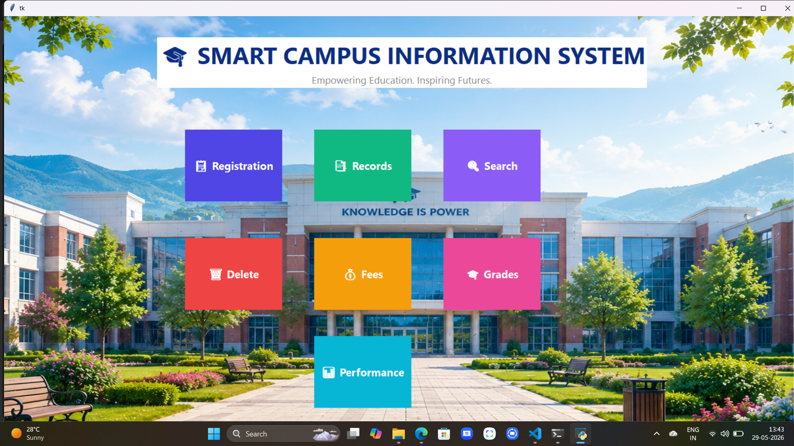
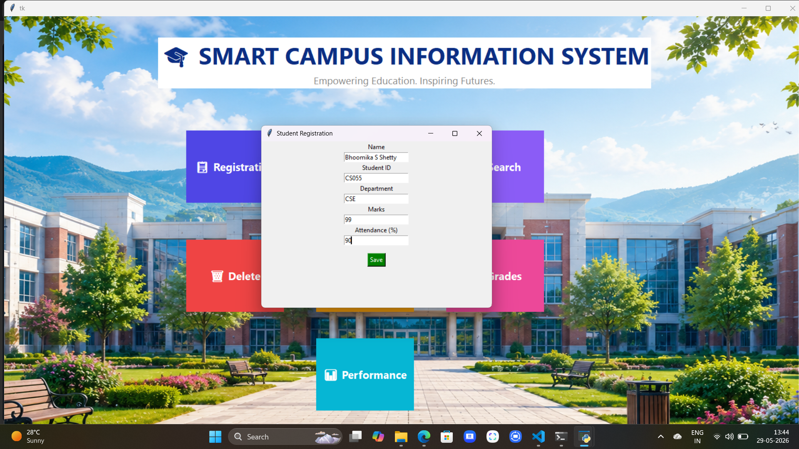
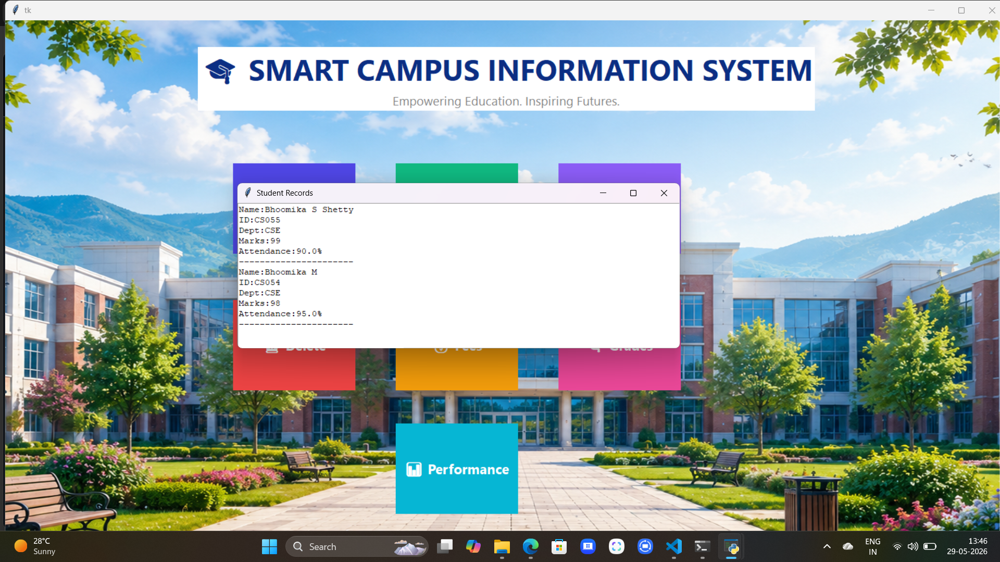
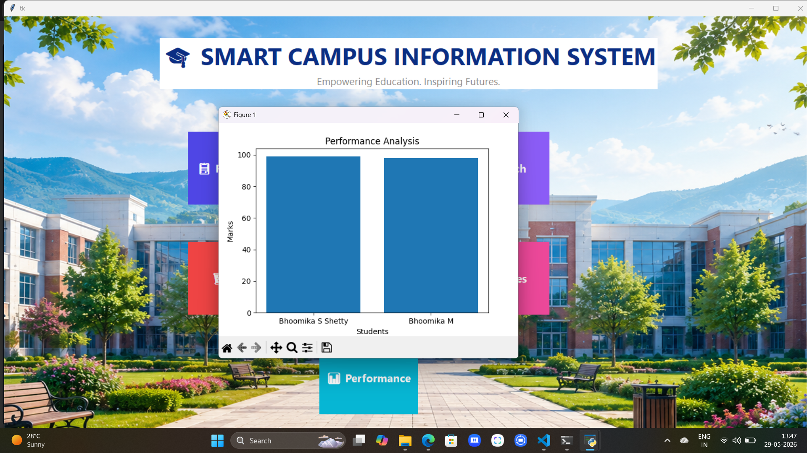

#Smart Campus Information System
A Python Tkinter-based Smart Campus Information System.

## Features
- Student Registration
- Student Records
- Search Student
- Delete Student
- Fee Calculator
- Grade Generator
- Performance Analysis
- Attractive Dashboard UI

## Technologies Used
- Python
- Tkinter
- Pillow
## Screenshots
### Dashboard

### Registration

### Student Records

### Performance Analysis

## Author
Bhoomika S Shetty,
Bhoomika M
